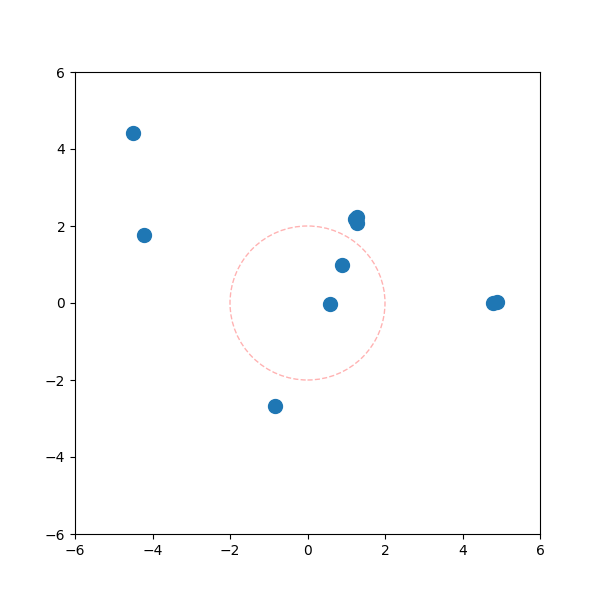
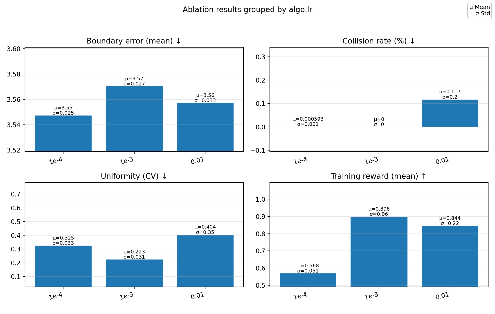

# Formation: Multi-Agent Reinforcement Learning (TorchRL)

[](https://github.com/elte-collective-intelligence/student-formation/actions/workflows/ci.yml)
[](https://github.com/elte-collective-intelligence/student-formation/actions/workflows/docker.yml)
[](https://codecov.io/gh/elte-collective-intelligence/student-formation)
[](LICENSE)

## About the project

This project implements a multi-agent reinforcement learning (MARL) system using TorchRL to train agents to form specific geometric shapes. The agents learn cooperative behavior through PPO (Proximal Policy Optimization) to achieve formation control.

### Key Features

- **Multiple Shape Support**: Circle, Polygon, and Star formations with dynamic reconfiguration
- **Assignment Strategies**: Hungarian and Greedy assignment strategies for optimal agent-target matching
- **Reward Functions**: Support for both SDF-based (shape boundary) and assignment-based (target position) rewards
- **Multi-Shape Scenes**: Agents can be assigned to multiple different shapes simultaneously
- **Visualization**: Real-time rendering and GIF generation of trained policies
- **Testing & CI/CD**: Comprehensive test suite with automated pipelines

### How It Works

1. **Environment**: Agents are placed in an arena and receive observations of their relative positions
2. **Target Formation**: A geometric shape defines the desired formation
3. **Assignment**: Agents are assigned to specific target positions using Hungarian or Greedy algorithms
4. **Training**: PPO trains agents to move toward their assigned positions while respecting arena boundaries
5. **Evaluation**: Trained models can be visualized and evaluated on formation accuracy

### Technologies

- **TorchRL**: Multi-agent reinforcement learning framework
- **PyTorch**: Deep learning backend
- **Hydra**: Configuration management
- **Weights & Biases**: Experiment tracking and visualization

## Setup

1. Make sure you have python version 3.11 or at least 3.10  
Check by running `python --version`. If you have older version please update.

2. Create virtual environment and activate it

```shell
python -m venv .venv && source .venv/bin/activate
```

3. Upgrade pip

```shell
python -m pip install --upgrade pip
```

4. Install runtime dependencies

```shell
pip install -r requirements.txt
```

## Usage

### Training

To train agents on a formation task, use:

```shell
python main.py
```

The default configuration trains agents to form a circle. Output including training metrics and model checkpoints are logged to W&B.

### Configuration

Training behavior is controlled through YAML config files in the `configs/` directory:

- **`configs/base/main_setup.yaml`**: Global settings (device, seed, project name)
- **`configs/algo/ppo.yaml`**: PPO algorithm hyperparameters (learning rate, epochs, clip epsilon)
- **`configs/env/formation.yaml`**: Environment settings (num_agents, arena_size, shape_type)
- **`configs/experiment/default_exp.yaml`**: Experiment configuration (combines all above)

#### Defining Shapes

Shapes are defined in `configs/env/formation.yaml`. Each shape type has specific parameters:

**Circle Formation**

```yaml
shape_type: circle
circle:
  center: [0.0, 0.0]    # Center coordinates [x, y]
  radius: 2.0           # Circle radius
```

**Polygon Formation**

```yaml
shape_type: polygon
polygon:
  vertices: [           # List of [x, y] vertices
    [-2.0, -2.0],
    [2.0, -2.0],
    [2.0, 2.0],
    [-2.0, 2.0]
  ]
```
Supports both convex and non-convex polygons. Agents are distributed evenly along the perimeter.

**Star Formation**

```yaml
shape_type: star
star:
  center: [0.0, 0.0]    # Center coordinates
  r1: 1.0               # Inner radius
  r2: 2.0               # Outer radius
  n_points: 5           # Number of star points
```

#### Multi-Shape Scenes with Reconfiguration

For complex scenarios with multiple shapes, use the `multishape` type:

```yaml
shape_type: multishape

multishape:
  shapes:
    - type: circle
      center: [-3.0, 0.0]
      radius: 1.5
      agent_count: 5     # Agents assigned to this shape
    
    - type: polygon
      vertices: [
          [2.0, -2.0],
          [4.0, -2.0],
          [4.0, 2.0],
          [2.0, 2.0]
        ]
      agent_count: 5     # Remaining agents assigned here

# Dynamic reconfiguration (switch formations mid-episode)
reconfig_step: 200      # When should the reconfiguration happen
reconfig_shape:
  shape_type: multishape    # Shape defined to switch to
  multishape:
    - type: polygon
      vertices: [[-4.0, 0.0], [-2.0, 0.0], [-2.0, -2.0], [-4.0, -2.0]] 
      agent_count: 5
    - type: circle
      center: [3.0, 0.0]
      radius: 1.5
      agent_count: 5
```

#### Assignment Strategies

Choose how agents are assigned to target positions:

```yaml
# Hungarian algorithm (optimal but slower)
assignment_method: "hungarian"

# Greedy algorithm (faster, near-optimal)
assignment_method: "greedy"
```

#### Example Configurations

**Circle with Hungarian Assignment**

```yaml
shape_type: "circle"
circle:
  center: [0.0, 0.0]
  radius: 2.0
assignment_method: "hungarian"
num_agents: 10
```

**Multi-Shape with Reconfiguration**

```yaml
shape_type: multishape
num_agents: 20

multishape:
  shapes:
    - type: circle
      center: [-2.0, 0.0]
      radius: 1.5
      agent_count: 10
    - type: star
      center: [2.0, 0.0]
      r1: 0.8
      r2: 1.8
      n_points: 5
      agent_count: 10

reconfig_shape:
  shape_type: multishape
  multishape:
    - type: polygon
      vertices: [[0, -2], [2, 0], [0, 2], [-2, 0]]
      agent_count: 10
    - type: circle
      center: [0.0, 0.0]
      radius: 2.0
      agent_count: 10
```

### Visualization

After training, visualize the learned policy using:

```shell
python visualize.py
```

This script:

- Loads the most recent trained model from W&B
- Runs the policy in the environment for several episodes
- Renders real-time visualization of agents forming the target shape
- Generates a GIF of the formation process
- Displays formation accuracy and episode metrics

Example output GIF:




### Metrics & Evaluation

There are 3 evaluation metrics after training. The evaluation is run at the end of training in `main.py` via `evaluate_with_metrics(...)` (see `src/rollout/evaluator.py` and `src/rollout/metrics.py`) and is logged to W&B.

Implemented metrics:

- **Boundary Error** (SDF distance to the target boundary)
  - Mean / max boundary error over agents
  - Percent of agents considered "on boundary"
- **Uniformity** (nearest-neighbor distance statistics)
  - Mean / std of nearest-neighbor distances
  - Coefficient of variation (std / mean)
- **Collisions** (pairwise distance threshold)
  - Collision count
  - Collision rate as percent of colliding pairs

W&B keys (logged at the end of training):

- `Evaluation/Boundary_Error_Mean`, `Evaluation/Boundary_Error_Max`, `Evaluation/Agents_On_Boundary_Pct`
- `Evaluation/Uniformity_Mean`, `Evaluation/Uniformity_Std`, `Evaluation/Uniformity_Coefficient`
- `Evaluation/Collision_Count_Mean`, `Evaluation/Collision_Rate_Pct`

### Ablations

Two Hydra multirun ablations are included under `configs/experiment/`.

1) **Learning rate ablation** (`configs/experiment/sweep_lr.yaml`)

```shell
python main.py -m -cn experiment/sweep_lr
```

This sweep fixes seeds (`base.seed: 0,1,2`), fixes assignment to Hungarian (`env.assignment_method: hungarian`), and varies `algo.lr`.

2) **Assignment method ablation** (`configs/experiment/sweep_assign.yaml`)

```shell
python main.py -m -cn experiment/sweep_assign
```

This sweep fixes seeds (`base.seed: 0,1,2`) and varies `env.assignment_method` (`greedy,hungarian`).

Hydra writes sweep outputs under:

- `multirun/YYYY-MM-DD/HH-MM-SS/<job_num>/...`

#### Ablation analysis

For quick aggregation across seeds and variants, use the included offline analysis script. The `--sweep-id` should match the Hydra sweep directory (the `multirun/.../HH-MM-SS` folder).

Learning rate sweep (group by `algo.lr`):

```shell
python analyze_ablations.py --group algo.lr --sweep-id "multirun/YYYY-MM-DD/HH-MM-SS"
```

Assignment method sweep (group by `env.assignment_method`):

```shell
python analyze_ablations.py --group env.assignment_method --sweep-id "multirun/YYYY-MM-DD/HH-MM-SS"
```

This prints mean/std for the tracked metrics and writes a `runs.csv` at the repository root.

#### Charts

To create a simple, presentation-ready chart from the latest `runs.csv` (produced by the offline ablation analysis), use:

```shell
python scripts/plot_runs_csv.py --csv runs.csv --group algo.lr
```

You can also pass `--title` to override the figure title, and `--exclude-reward` to plot only evaluation metrics.


This writes a PNG under `docs/charts/` (default: `docs/charts/ablation_algo.lr.png`).

Example ablation plot:



Notes:

- `--exclude-reward` keeps only evaluation metrics (`Evaluation/*`). Training reward (`Reward/MeanRewardInBatch`) is not part of the evaluation metrics section.
- The arrows next to subplot titles indicate direction of better: `↓` lower is better, `↑` higher is better.

### Reproducibility pack

**Hydra configs (experiments + sweeps)**

- `configs/experiment/default_exp.yaml`
- `configs/experiment/sweep_lr.yaml`
- `configs/experiment/sweep_assign.yaml`
- `configs/env/formation.yaml`
- `configs/algo/ppo.yaml`
- `configs/base/main_setup.yaml`

**Dockerfile (build + run)**

Build:

```shell
docker build -f docker/Dockerfile -t formation-task .
```

Run training in the container:

```shell
docker run --rm formation-task
```

If you want to avoid W&B login inside Docker, run in offline mode:

```shell
docker run --rm -e WANDB_MODE=offline formation-task
```

**Unit / smoke tests**

Tests cover environment initialization/reset/step, SDF sanity check, assignment behavior, and PPO actor output.

- Run with pytest:

```shell
pytest -q
```

- Or run unittest discovery:

```shell
python -m unittest discover -s test
```

## Running tests

```shell
python -m unittest discover -s test
```

## Work distribution

### Márk Baricz

- SDF interface, including support for three shapes (circle, polygon, star)
- Redesign of the observations and rewards with SDF terms
- Render support for the new shapes
- Fixing the visualizer script and GIF generation (visualizing target shapes and positions, loading trained model)
- Implementation of the Hungarian and Greedy assignment strategies
- Support for multi-shape scenes
- Support for dynamic reconfiguration mid-episode (even with multi-shape scenes)
- Fixing the tests and CI/CD pipelines

### Sipos Richard

- Implementation of metrics (Boundary Error/Collision/Uniformity)
- Hydra multirun support for sweeps and reproducibility
- Ablation configurations for learning-rate and assignment-method sweeps
- Ablation analysis producing aggregated metrics + save to CSV
- Docker packaging fixes (build context / run command / issue of large folders)
- Update Vizualization's model to consider
- Fix Windows specific test issues