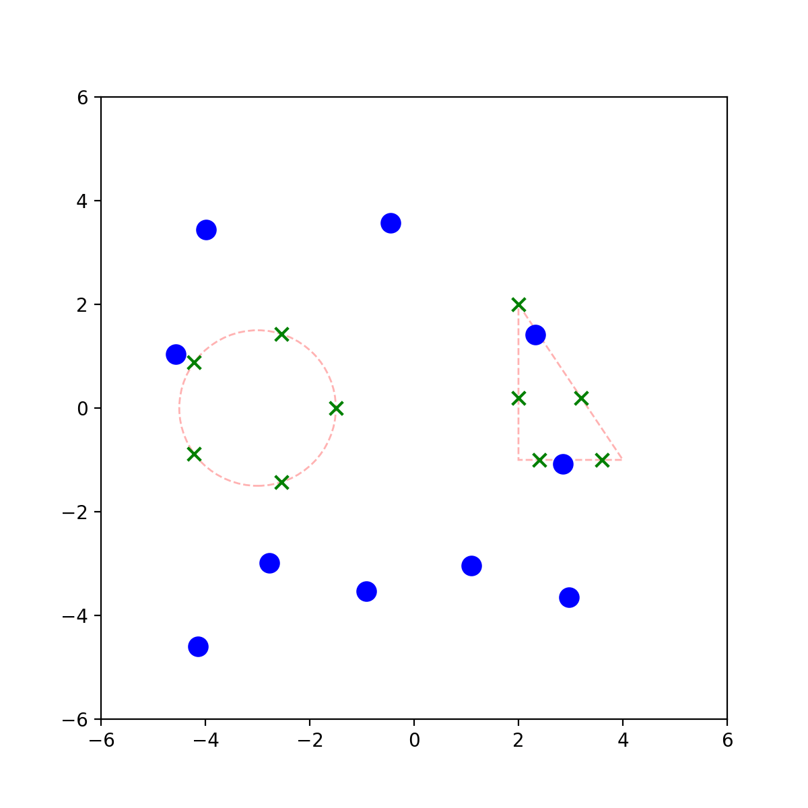

# Formation: Multi-Agent Reinforcement Learning

[](https://github.com/elte-collective-intelligence/student-formation/actions/workflows/ci.yml)
[](https://github.com/elte-collective-intelligence/student-formation/actions/workflows/docker.yml)
[](https://codecov.io/gh/elte-collective-intelligence/student-formation)
[](LICENSE)

---

This repository implements a TorchRL/PPO multi-agent formation-control task for the Collective Intelligence assignment. The project extends the baseline circle task into a reproducible study with arbitrary shapes, multi-shape scenes, dynamic reconfiguration, assignment strategies, SDF-based observations/rewards, metrics, ablations, plots, and a rollout GIF.



---

## Table of Contents

1. [Features](#features)
2. [Setup](#setup)
3. [Training](#training)
4. [Configuration](#configuration)
5. [Experiments](#experiments)
6. [Analysis](#analysis)
7. [Visualization](#visualization)
8. [Metrics](#metrics)
9. [Tests](#tests)
10. [Docker](#docker)
11. [Work Distribution](#work-distribution)
12. [Assignment Checklist](#assignment-checklist)

---

## Features

- Shape support for circle, ellipse, polygon, star, and multi-shape scenes.
- Dynamic reconfiguration during an episode.
- Hungarian and greedy assignment strategies.
- SDF-based observation and reward terms.
- Evaluation metrics for boundary error, collisions, uniformity, and reconfiguration.
- Hydra configs for reproducible single runs and sweeps.
- Offline W&B logging, CSV extraction, plotting, Docker setup, and tests.

## Setup

Use Python 3.10 or newer.

```shell
python -m venv .venv
source .venv/bin/activate
python -m pip install --upgrade pip
pip install -r requirements.txt
```

If `python` is not available on your system, use `.venv/bin/python` in the commands below.

## Training

Default training uses the current multi-shape reconfiguration setup from `configs/env/formation.yaml`.

```shell
WANDB_MODE=offline python main.py
```

The main environment has 10 agents. The initial target is a circle plus a polygon. At `reconfig_step: 200`, the target changes to a polygon plus a circle.

## Configuration

Main config files:

- `configs/base/main_setup.yaml`: seed, device, project name.
- `configs/algo/ppo.yaml`: PPO hyperparameters.
- `configs/env/formation.yaml`: environment, shapes, assignment, observations, physics.
- `configs/experiment/default_exp.yaml`: default Hydra composition.
- `configs/experiment/sweep_assign.yaml`: greedy vs Hungarian assignment ablation.
- `configs/experiment/sweep_geometry_obs.yaml`: SDF observation on/off ablation.
- `configs/experiment/sweep_lr.yaml`: optional learning-rate sweep.

Supported shape types:

```yaml
shape_type: circle
shape_type: ellipse
shape_type: polygon
shape_type: star
shape_type: multishape
```

Current multi-shape format:

```yaml
shape_type: multishape
multishape:
  - type: circle
    center: [-3.0, 0.0]
    radius: 1.5
    agent_count: 5
  - type: polygon
    vertices: [[2.0, 2.0], [4.0, -1.0], [2.0, -1.0]]
    agent_count: 5
```

Dynamic reconfiguration is configured with:

```yaml
reconfig_step: 200
reconfig_shape:
  shape_type: multishape
  multishape:
    - type: polygon
      vertices: [[-4.0, 0.0], [-2.0, 0.0], [-2.0, -2.0], [-4.0, -2.0]]
      agent_count: 5
    - type: circle
      center: [3.0, 0.0]
      radius: 1.5
      agent_count: 5
```

## Experiments

The two assignment-relevant sweeps used for the final results are:

```shell
WANDB_MODE=offline python main.py -m -cn experiment/sweep_assign
WANDB_MODE=offline python main.py -m -cn experiment/sweep_geometry_obs
```

Both sweeps use seeds `0, 1, 2`.

The assignment sweep varies:

```yaml
env.assignment_method: greedy,hungarian
```

The geometry-observation sweep varies:

```yaml
env.use_sdf_obs: true,false
```

Hydra writes sweep folders under:

```text
multirun/YYYY-MM-DD/HH-MM-SS/
```

## Analysis

After a sweep finishes, aggregate metrics with:

```shell
python analyze_ablations.py --group env.assignment_method --sweep-id "multirun/YYYY-MM-DD/HH-MM-SS"
python analyze_ablations.py --group env.use_sdf_obs --sweep-id "multirun/YYYY-MM-DD/HH-MM-SS"
```

This writes `runs.csv`. Charts can be generated with:

```shell
python scripts/plot_runs_csv.py --csv runs.csv --group env.assignment_method
python scripts/plot_runs_csv.py --csv runs.csv --group env.use_sdf_obs
```

`analyze_ablations.py` writes a summary `runs.csv`, and `scripts/plot_runs_csv.py` renders comparison charts from it. Per-cohort result writeups and artefacts live on the respective semester branches, not on `main`.

## Visualization

Generate a rollout GIF with:

```shell
WANDB_MODE=offline python visualize.py
```

If the latest checkpoint was trained with `env.use_sdf_obs=false`, use:

```shell
WANDB_MODE=offline python visualize.py env.use_sdf_obs=false
```

A sample rollout is included at `formation.gif`.

## Metrics

Evaluation runs at the end of training through `evaluate_with_metrics(...)`.

Logged W&B keys include:

- `Evaluation/Boundary_Error_Mean`
- `Evaluation/Boundary_Error_Max`
- `Evaluation/Agents_On_Boundary_Pct`
- `Evaluation/Uniformity_Mean`
- `Evaluation/Uniformity_Std`
- `Evaluation/Uniformity_Coefficient`
- `Evaluation/Collision_Count_Mean`
- `Evaluation/Collision_Rate_Pct`
- `Evaluation/Reconfiguration_Time_Mean`

## Tests

Run:

```shell
python -m pytest test -q
```

Latest verification:

```text
11 passed, 1 warning
```

The warning is a dependency deprecation warning from `pygame`, not a project failure.

## Docker

Build:

```shell
docker build -f docker/Dockerfile -t formation-task .
```

Run:

```shell
docker run --rm -e WANDB_MODE=offline formation-task
```

## Work Distribution

Team members: Hoxha Art, Polácsek Zoltán, Zhu Zhenyu.

- Hoxha Art: SDF geometry interface, new shape support, observation and reward redesign, assignment strategies, implementation cleanup.
- Polácsek Zoltán: multi-shape scenes, dynamic reconfiguration, evaluation metrics, assignment ablation reporting, presentation structure.
- Zhu Zhenyu: SDF observation ablation reporting, reproducibility summary, final presentation support.

## Assignment Checklist

- Task 1: SDF interface, new shapes, SDF observations/rewards, renderer support.
- Task 2: Hungarian and greedy assignment strategies, with comparison.
- Task 3: Multi-shape scene and mid-episode reconfiguration.
- Task 4: Boundary error, collision, uniformity, and reconfiguration metrics.
- Task 5: Assignment and SDF-observation ablations with fixed seeds.
- Task 6: Hydra configs, Docker setup, and tests.
- Task 7: Report artefacts, plots, tables, and failure/trade-off discussion.
